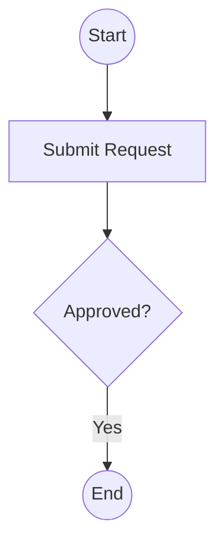

# Workflow Inference from PDF Diagrams

## 📋 Overview

This POC automatically extracts business process workflows from PDF documents containing workflow diagrams and converts them into structured JSON format. 

The system uses a sophisticated 3-stage LLM-based pipeline powered by AWS Bedrock (Claude models) to extract workflow nodes, connections, decision branches, and edge labels with high accuracy.

**Key Features:**
- ✅ Extracts workflow diagrams from PDFs
- ✅ Two level mermaid code extraction for workflow JSON creation
- ✅ Generates structured JSON with decision nodes and branches
- ✅ Captures edge labels for connections (e.g., "Approved", "Rejected")
- ✅ Supports decision nodes with context-aware branch names
- ✅ Extracts workflow names and descriptions using LLM
- ✅ Token counting and cost analysis for different Claude models

---

## 🏗️ Process Architecture

### High-Level Process Flow

```
PDF Document

    ↓
[PAGE EXTRACTION]
    ├─ Extract all pages as high-resolution images (300 DPI)
    ├─ Text-based pre-filtering (workflow keyword detection)
    └─ Validate page structure (edge density, connectivity)

    ↓
[VALID WORKFLOW PAGES]

    ↓
[THREE-STAGE LLM PIPELINE]
    ├─ STAGE 1: Vision-based arrow/node extraction (Claude Opus)
    ├─ STAGE 2: Mermaid code generation (Claude Sonnet)
    └─ STAGE 3: Name & description extraction (Claude Sonnet)

    ↓
[MERMAID CODE PARSING]
    ├─ Extract nodes with types (Rectangle, Diamond, Circle, Oval)
    ├─ Parse connections and edge labels
    └─ Identify decision nodes

    ↓
[JSON GENERATION]
    ├─ Create task objects with UUIDs
    ├─ Build decision node structures with branches
    ├─ Link connections with labels as descriptions
    └─ Handle backward arrows and loops

    ↓
[OUTPUT JSON]
    ├─ Workflow metadata (name, description)
    ├─ Tasks with types and descriptions
    ├─ Decision nodes with branch configurations
    └─ Connections with labels and descriptions
```

---

## 🔄 Three-Stage LLM Pipeline

### **STAGE 1: Arrow & Node Extraction (Vision Analysis)**

**Purpose:** Extract all nodes and arrows from the PDF image as natural language descriptions

**Model:** AWS Bedrock Claude Opus 4.5 (Vision-enabled)
- **Model ID:** `claude-opus-4-5-20251101-v1:0`
- **Cost:** $15/$75 per million tokens (input/output)

**What it does:**
1. Analyzes the workflow diagram image
2. Identifies all connected nodes (shapes with arrows)
3. Classifies node types: RECTANGLE, DIAMOND, CIRCLE, OVAL, PARALLELOGRAM
4. Extracts all arrows with directions (up, down, left, right, diagonal)
5. Captures edge labels (text on arrows)
6. Detects backward arrows (loops and error handling paths)
7. Filters out swimlanes and non-workflow elements

**Output:** Natural language description of nodes and arrows
```
NODE_1: CIRCLE "Start"
NODE_2: RECTANGLE "Submit Request"
NODE_3: DIAMOND "Approved?"
NODE_4: CIRCLE "End"

ARROW_1: FROM "Start" TO "Submit Request" DIRECTION: down LABEL: NONE
ARROW_2: FROM "Submit Request" TO "Approved?" DIRECTION: right LABEL: NONE
ARROW_3: FROM "Approved?" TO "End" DIRECTION: right LABEL: Yes
```

**Key Features:**
- Mandatory backward arrow detection (loops, retries, error paths)
- Zero-tolerance for label inference (only captures visible text)
- Swimlane filtering (ignores visual grouping containers)
- Connected nodes only (ignores standalone annotations)

---

### **STAGE 2: Mermaid Code Generation (Text Processing)**

**Purpose:** Convert Stage 1 natural language descriptions into executable Mermaid flowchart syntax

**Model:** AWS Bedrock Claude Sonnet 4.5 (Text-only)
- **Model ID:** `claude-sonnet-4-5-20250929-v1:0`
- **Cost:** $3/$15 per million tokens (input/output)

**What it does:**
1. Receives Stage 1 text output
2. Validates node types and counts
3. Generates Mermaid flowchart syntax:
   - Rectangles: `A[text]`
   - Diamonds: `B{text}`
   - Circles: `C((text))`
   - Ovals: `D[/text\]`
   - Parallelograms: `E[\\text\\]`
4. Creates connections with labels: `A -->|label| B`
5. Preserves arrow directions and labels
6. No inference of missing labels (strict no-inference rule)

**Output:** Valid Mermaid flowchart code


**Key Features:**
- No hallucination of missing labels
- Strict adherence to Stage 1 output
- Direct 1:1 mapping of nodes and arrows
- Cost-optimized (Sonnet instead of Opus)

---

### **STAGE 3: Workflow Name & Description Extraction**

**Purpose:** Extract meaningful workflow name and description from the diagram

**Model:** AWS Bedrock Claude Sonnet 4.5 (Text-only)
- **Model ID:** `claude-sonnet-4-5-20250929-v1:0`
- **Cost:** $3/$15 per million tokens (input/output)

**What it does:**
1. Reuses Stage 1 text output (no new image processing)
2. Analyzes nodes and flow to understand workflow purpose
3. Generates descriptive workflow name
4. Creates comprehensive workflow description
5. Extracts key process steps and decision points

**Output:** Workflow metadata
```json
{
  "workflow_name": "Travel Request Management",
  "workflow_description": "This workflow manages business travel requests from submission through approval, advance payments, booking, and expense reconciliation..."
}
```

**Key Features:**
- Cost-optimized: reuses Stage 1 output (no image re-processing)
- 80% token savings vs reprocessing image
- Generates business-friendly names and descriptions
- Understands workflow context from extracted nodes

---

## 📁 File Structure & Descriptions

### Core Processing Files

#### **1. `create_workflow.py` (Main Orchestrator)**
- **Purpose:** Main entry point - orchestrates the entire workflow extraction pipeline
- **Key Functions:**
  - `extract_pages_as_images()`: Extracts PDF pages as high-resolution images
  - `enhance_workflow_image()`: Improves image quality for LLM processing
  - `is_valid_workflow_page()`: Validates if page contains a workflow
  - `extract_mermaid_two_stage()`: Runs Stage 1 & Stage 2
  - `extract_workflow_name_from_stage1()`: Runs Stage 3
  - `convert_items_to_workflow_json_with_decisions()`: Builds final JSON
- **Output:** JSON files in `workflow_json/` directory (one per workflow)
- **Input:** PDF file path in `pdf_images/` directory

**Usage:**
```python
# Edit pdf_name variable at top of file
pdf_name = "your_workflow.pdf"
python create_workflow.py
```

---

#### **2. `two_stage_mermaid_extraction.py` (Stage 1 & 2 LLM Calls)**
- **Purpose:** Manages Stage 1 (arrow extraction) and Stage 2 (Mermaid generation) LLM calls
- **Key Functions:**
  - `stage1_extract_arrows()`: AWS Bedrock call for vision-based arrow extraction
  - `stage2_generate_mermaid()`: AWS Bedrock call for Mermaid code generation
  - `extract_mermaid_two_stage()`: Orchestrates both stages
  - `is_valid_workflow_page()`: Validates workflow pages
- **Models Used:**
  - Stage 1: Claude Opus 4.5 (Vision)
  - Stage 2: Claude Sonnet 4.5 (Text)

---

#### **3. `create_mermaid_from_image.py` (Parsing & JSON Generation)**
- **Purpose:** Parses Mermaid code and converts to JSON workflow format
- **Key Functions:**
  - `extract_workflow_from_mermaid_and_image()`: Parses Mermaid code
  - `parse_mermaid_connections()`: Extracts connections with labels
  - `convert_items_to_workflow_json_with_decisions()`: Builds JSON with decision nodes
  - `extract_workflow_name_from_stage1()`: Extracts name/description via Stage 3 LLM
- **Processing Steps:**
  1. Parses node definitions from Mermaid
  2. Extracts all connection patterns
  3. Identifies decision nodes and branches
  4. Maps node letters to unique IDs
  5. Builds task objects with types
  6. Creates decision node structures with branch IDs
  7. Generates final JSON with connections and labels

**Decision Node Handling:**
- Identifies decision nodes (DIAMOND type `{}`)
- Extracts branch labels from arrow labels
- Creates branch configurations with conditional expressions
- Handles unnamed decision nodes with default "Decision" name
- Preserves custom branch names (Approved/Rejected, Accept/Decline, etc.)

**Edge Label Preservation:**
- Captures all visible labels from arrows
- Adds both `label` and `description` fields to connections
- Supports custom labels beyond Yes/No
- Examples: "Advance Payment Required", "Employee return date", "Modify"

---

#### **4. `handle_process_doc_pdf_with_image.py` (Image Processing)**
- **Purpose:** Utility functions for image encoding and processing
- **Key Functions:**
  - `image_base64_encoder()`: Converts image to base64 for AWS Bedrock
  - Handles image format detection (PNG, JPEG, WebP, GIF)
- **Output:** Base64 encoded image strings for LLM processing

---

#### **5. `pdf_image_conversion.py` (PDF to Image Conversion)**
- **Purpose:** Converts PDF pages to high-resolution images
- **Key Functions:**
  - `extract_pages_as_images()`: Extracts all pages as PNG images at specified DPI
  - `enhance_workflow_image()`: Applies image enhancements for better LLM processing
    - Increases contrast
    - Adjusts brightness
    - Applies sharpening
- **DPI:** 300 DPI (high resolution for workflow diagram clarity)
- **Output:** PNG images in `extracted_images/` directory

---

### Utility & Analysis Files

#### **6. `count_tokens_for_pdf.py` (Cost Analysis)**
- **Purpose:** Calculates token usage and costs for different Claude models
- **Supported Modes:**
  - `sonnet`: Pure Claude Sonnet 4.5
  - `opus`: Pure Claude Opus 4.5
  - `hybrid`: Opus Stage 1 + Sonnet Stage 2-3 (43% cost savings)
- **Outputs:**
  - Input/output token counts
  - Cost breakdown per stage
  - Total cost comparison
  - Cost savings analysis

**Usage:**
```python
python count_tokens_for_pdf.py
# Shows token counts and costs for one PDF across all three scenarios
```

**Pricing (per million tokens):**
- Sonnet: $3 (input), $15 (output)
- Opus: $15 (input), $75 (output)
- Hybrid (recommended): 30-40% savings vs Opus
---

### Configuration & Data Files

#### **Input Directory: `pdf_images/`**
- Contains PDF files to process
- Example: `travel_request.pdf`, `heart_disease_flow.pdf`

#### **Output Directory: `workflow_json/`**
- Contains extracted workflow JSON files
- Naming convention: `{pdf_name}_page{N}_workflow.json` (for multi-page PDFs)
- Example: `travel_request_page1_workflow.json`

#### **Intermediate Directory: `extracted_images/`**
- Temporary storage for extracted PDF page images
- High-resolution PNG files for LLM processing
---

## 📊 JSON Output Structure

### Example Workflow JSON

```json
{
  "id": "47510a2c-e5a9-4a86-a7d1-5d93e78f9889",
  "name": "Business Travel Request Management",
  "description": "This workflow manages the complete business travel process...",
  "busNo": 0,
  "version": "0.1.0",
  "tasks": {
    "6baf77a7-8861-4f66-b034-5bd14fa97fbb": {
      "id": "6baf77a7-8861-4f66-b034-5bd14fa97fbb",
      "data": {
        "type": "Start",
        "name": "Start",
        "description": ""
      },
      "startNode": true,
      "endNode": false
    },
    "bdcd4290-b401-48be-bb7d-117f2d5696a3": {
      "id": "bdcd4290-b401-48be-bb7d-117f2d5696a3",
      "data": {
        "type": "Decision",
        "name": "Approved?",
        "description": "",
        "inputs": [
          {
            "name": "conditions",
            "value": "[{\"Expressions\": [{...}], \"Branch\": {\"BranchId\": \"945f5931-...\", \"BranchName\": \"Approved\"}}]"
          },
          {
            "name": "defaultBranch",
            "value": "{\"BranchId\": \"867993fa-...\", \"BranchName\": \"Rejected\"}"
          }
        ]
      },
      "startNode": false,
      "endNode": false
    }
  },
  "connections": [
    {
      "source": {
        "taskId": "6baf77a7-8861-4f66-b034-5bd14fa97fbb",
        "branchType": "output",
        "branchId": "6baf77a7-8861-4f66-b034-5bd14fa97fbb-output"
      },
      "target": {
        "taskId": "6b72dfd4-3666-4263-849a-2f2980d070e1",
        "branchType": "input",
        "branchId": "6b72dfd4-3666-4263-849a-2f2980d070e1-input"
      },
      "label": "Advance Payment Required",
      "description": "Advance Payment Required"
    }
  ]
}
```

### JSON Components

- **Workflow Metadata:**
  - `id`: Unique identifier (UUID)
  - `name`: Workflow name (extracted via Stage 3)
  - `description`: Workflow description (extracted via Stage 3)
  - `version`: Version tracking

- **Tasks (Nodes):**
  - `type`: Node type (Start, End, General, Decision)
  - `name`: Node label/text
  - `description`: Node details
  - `startNode`/`endNode`: Flow markers
  - For Decision nodes: `inputs` with branch configurations

- **Connections:**
  - `source`: Starting node/branch reference
  - `target`: Ending node/branch reference
  - `label`: Edge label (optional, if visible on arrow)
  - `description`: Same as label (for consistency)

- **Decision Branches:**
  - Conditional expressions with branch IDs
  - Default branch for no-match cases
  - Smart branch naming (Approved/Rejected, Yes/No, Accept/Decline)

---

## 🚀 How to Run

### Prerequisites

1. **Python Dependencies:**
   ```bash
   pip install -r requirements.txt
   ```

   **Key Libraries:**
   - `boto3`: AWS Bedrock integration
   - `PyMuPDF (fitz)`: PDF processing
   - `Pillow`: Image processing
   - `opencv-python`: Image enhancement
   - `numpy`: Array processing

2. **PDF Files:**
   - Place workflow PDFs in `pdf_images/` directory
   - Example: `pdf_images/travel_request.pdf`

### Step-by-Step Execution

1. **Place PDF in input directory:**
   ```bash
   cp your_workflow.pdf pdf_images/
   ```

2. **Update PDF name in `create_workflow.py`:**
   ```python
   pdf_name = "your_workflow.pdf"
   ```

3. **Run the extraction pipeline:**
   ```bash
   python create_workflow.py
   ```

4. **Check output:**
   ```bash
   ls workflow_json/
   # Expected output: your_workflow_page1_workflow.json, etc.
   ```

### Example: Travel Request Workflow

```bash
# 1. Input file already present
ls pdf_images/travel_request.pdf

# 2. Run extraction
python create_workflow.py

# 3. Output generated
ls workflow_json/
# travel_request_workflow.json  (1 page → 1 workflow)
```

## 📈 Cost Optimization Strategies

### Three Processing Scenarios

1. **Pure Sonnet (Economical)**
   - All stages: Claude Sonnet 4.5
   - Cost: ~$0.02-0.05 per PDF
   - Trade-off: Lower accuracy for Stage 1

2. **Pure Opus (High Quality)**
   - All stages: Claude Opus 4.5
   - Cost: ~$0.10-0.20 per PDF
   - Benefit: Best extraction accuracy

3. **Hybrid (Recommended) - 30-40% Savings**
   - Stage 1: Claude Opus 4.5 (vision accuracy)
   - Stage 2-3: Claude Sonnet 4.5 (text optimization)
   - Cost: ~$0.08-0.15 per PDF (approx 30-40% savings vs Pure Opus)
   - Benefit: Optimal accuracy + cost efficiency

**Stage 3 Optimization:**
- Reuses Stage 1 text output (no new image processing)
- Avoids redundant vision API calls
- 80% token savings for Stage 3

### Token Usage Example

For `travel_request.pdf`:

| Scenario | Total Tokens | Total Cost |
|----------|-------------|-----------|
| Sonnet 4.5 (all stages) | 8,171 | $0.0414 |
| Opus 4.5 (all stages) | 8,198 | $0.2077 |
| Hybrid (Opus + Sonnet) | 8,623 | $0.1470 |

**Cost Savings:**
- Hybrid vs Pure Opus: **29% savings** ($0.1470 vs $0.2077)
- Hybrid vs Pure Sonnet: +$0.1056 (improved accuracy for Stage 1 vision analysis)

---

## 🔍 Quality Assurance & Validation
### Known Limitations

1. **Backward Arrows Detection:** While the system detects backward arrows (loops, retries), the visual distinction in some diagrams can be ambiguous. Arrows that curve or overlap may be misidentified as forward arrows, especially in dense workflow diagrams. Stage 1 prompt includes mandatory backward arrow detection but relies on clear visual separation.

2. **Spatial Proximity Issues:** When nodes are placed very close together or arrows have overlapping paths, the LLM may struggle to correctly match arrow endpoints to source/target nodes. This can result in:
   - Arrows connected to wrong nodes
   - Missing arrows when paths overlap
   - Ambiguous direction detection

3. **Swimlane Handling:** Swimlanes are filtered out (visual organization only)

4. **Nested Subprocesses:** Currently not decomposed (treated as single task)

5. **Complex Styling:** Some styled decision nodes may be misclassified (rare)

6. **Image Quality:** Very low-resolution PDFs may yield poor results

---

## 📄 Technology Stack:

- AWS Bedrock (Claude models)
- PyMuPDF for PDF processing
- Mermaid for flowchart syntax
- OpenCV for image enhancement

### AWS Bedrock Models Used

| Stage | Model | Cost (per M tokens) | Purpose |
|-------|-------|-------------------|---------|
| 1 | Claude Opus 4.5 | $15/$75 | Vision analysis (arrows, nodes) |
| 2 | Claude Sonnet 4.5 | $3/$15 | Text processing (Mermaid generation) |
| 3 | Claude Sonnet 4.5 | $3/$15 | Text processing (name extraction) |

---